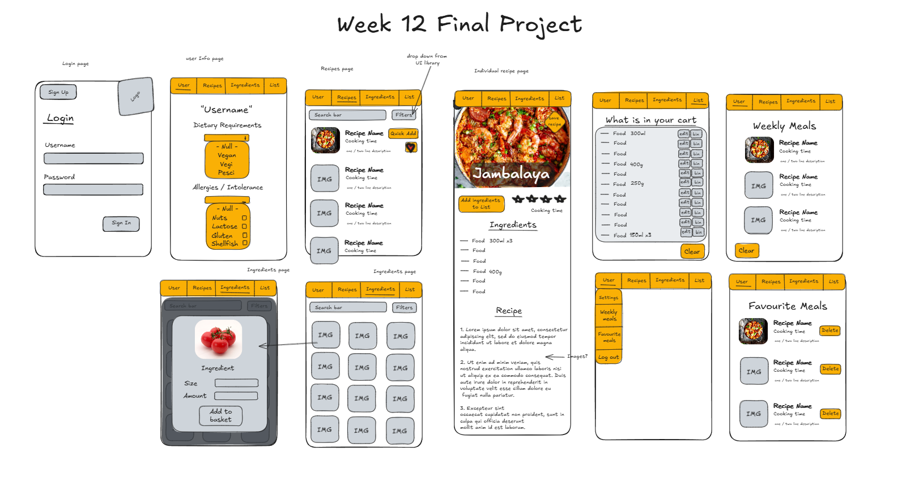

# Project name: List It

## Vercel link: https://week12-list-it.vercel.app/

## Repo link: https://github.com/zkrylbntz/week12-list-it

## Team members:

- Anu, [Anu](https://github.com/anuseed)
- Joe, https://github.com/joegalvinn
- Kat, https://github.com/kmday404
- Zak, https://github.com/zkrylbntz

## Project description:

A site which both allows you to plan your weekly meals and generates a shopping list based on the recipes you have selected.

### Problem domain:

People don't always know what ingredients are needed to create a meal they would like to make, and coming up with recipe ideas isn't always easy.

### User stories:

[x] As a user, I would like to log in to the site and set my food preferences/intolerances

[x] As a user, I would like to see recipes based on my preferences/intolerances

[x] As a user, I would like to add recipes I like to my weekly meal plan

[x] As a user, I would like to add all items from my recipes to my shopping list

[x] As a user, I would like to see all my items displayed in my shopping list

[x] As a user, I would like to check off the list the items I already have or whilst I am purchasing them

Wireframe: 

### Libraries, frameworks and packages the application requires in order to properly function:

pg, Daisy UI, tailwindcss, clerk

### Instructions on how to run your app:

1. Sign up from the home page using your email address or github
2. Set your user details (username and dietary requirements)
3. Browse the recipes, using the search and filter features if desired
4. Click "Start Weekly Shop" to enable the feature which allows you to add recipes to your plan
5. The heart button will add the recipe to your favourites, the cart button will add the recipe to your weekly plan
6. You can access your favourites, weekly plan and settings to change your user details from the 'User' drop down in the header
7. To view the full details of any individual recipe (including instructions, ingredients, servings etc) you can click on the image of the recipe (this works from both the recipe page and weekly meal page)
8. Access your shopping list from the 'List' header link or use the "view shoppinng list" button in the weekly meal page
9. If you remove individual recipes from your weekly meals, this will remove the ingredients from your list
10. To clear your weekly plan and list, you need only start a new weekly shop using the "Start Weekly Shop" button

Lighthouse report:

### Reflections:

Additional features:
[x] As a user, I would like to filter the recipes based on difficulty, food intolerances and meal type

[x] As a user, I would like to search for recipes

[] As a user, I would like to add or remove individual ingredients from my shopping list

[] As a user, I would like the ingredients on my list to consolidate and duplicates (updated the amounts needed)

[] As a user, I would like to be able to switch between light and dark themes

[] As a user, I would like to change the servings and this adjust the ingredient amounts needed

Detailing useful external sources that helped you complete the assignment (e.g Youtube tutorials).

Describing errors or bugs you encountered while completing your assignment.

### References:

Data originated from https://dummyjson.com/recipes
